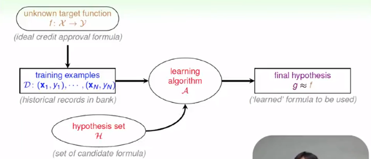

# Introduce

## WHEN can machine Learn?

> When and why should we use machine learning rather than other algorithms? What fields does machine learning  be applied to?

### When should we use ML

​	Learning is the process acquiring  skill from observation. According this definition, machine learning is nothing more than **changing the subject of learning from person to machine.** For a person, the input of learning comes from our sense, such as  visual, auditory. But for a machine, the input is binary data given by people. Both people and machine have the same target that we can perform better on a specific field after learning process. So machine can be illustrate by the following graph:

​	So why should we use ML? After all, applying other algorithms that don't learn, we can also get not bad performance in some field. However, human can not give structure and specific rules for all questions. For example, facing the problem that computers judge if there are trees in a image, no one could find quite specific rules working on computers to solve this. We want machine can acquire this skill by itself, that is just machine learning.

​	All in all, when faced with these following scenarios we should resort to ML:

-   when human **cannot program the system manually**: navigation on Mars
-   when human **cannot define the solution easily**: visual/ speech recognition
-   when needing **rapid decisions that human cannot do**: high-frequency trading
-   when needing to be **user-oriented in a massive scale**: consumer-targeted marketing 
-   ...

Machine learning is powerful but may not work for some fields. Generally speaking, we use machine learning when problem follow these key essences:

1.  exists some **'underlying pattern'** to be learned: we can improve performance
2.  **no (easy) programmable definition**: otherwise, we just write it down
3.  **data is available**: we have input

### Basic Components

​	Basic components of learning problem can be describe as:

-   input space $\mathcal{X}$: all possible input set
-   output space $\mathcal{Y}$:all possible output set
-   data $\mathcal{D}=\{(x_1,y_1),...,(x_N,y_N)\}$, where $x\in \mathcal{X}, y\in \mathcal{Y}$
-   target function $f$: pattern to be learned, the ideal distribution between $\mathcal{X},\mathcal{Y}$ or$\mathcal{X}\to\mathcal{Y}$
-   Hypothesis set $\mathcal{H}$: all possible  $\mathcal{X}\to\mathcal{Y}$ pattern  set
-   Hypothesis $g$: $g\in\mathcal{H}$ , learned formula $\mathcal{X}\to\mathcal{Y}$ with hopefully good performance
-   Algorithm $\mathcal{A}$: method used to select $g$ from $\mathcal{H}$

Slide above show relationship among all these components. It easy to understand. First, we have data set which following ideal pattern, then algorithm takes data set as input, select a relatively good hypothesis from hypothesis set. If the learning algorithm works well, it should find a hypothesis approximately equaling to target function. So we can also define machine learning as: **Using data to compute hypothesis that approximates target hypothesis.**

### ML and Other Fields

​	There exists several fields similar to ML, including Data Mining, Artificial Intelligence and Statistic.

​	**Data Mining**.  DM is 'use huge data to find property that is interesting'. So if 'interesting property' 

1.  **is** 'hypothesis approximating target',  DM = ML
2.  **is related to** 'hypothesis approximating target', DM can help ML

In addition, traditional DM focuses on efficient computation in large database.

​	**Artificial Intelligence**. AI is 'compute something that show intelligence behavior'. So we can regard ML as a  route to AI.

​	**Statistic**. Statistic is 'use data to make inference about unknown process'. So if 'unknow process' is 'hypothesis', statistic can be used by ML. Statistic provides many useful tools for ML. Statistic focus more on mathematic than computation.

## Type of Learning

This chapter classifies learning models according to different criteria. Just make a summary.

According to **Output space** $\mathcal{Y}$:

- binary classification
- multi-class classification
- regression
- Structured learning: Sequence Tagging

According to **Data Label** $y_n$:

- supervised learning: all $y_n$
- unsupervised learning: no $y_n$
- semi-supervised learning: some $y_n$
- reinforcement learning: implicit $y_n$ by goodness($y_n$)

According to **Protocol** $(x_n, y_n)$:

- batch learning: all known data
- on-line learning: sequential (passive) data
- activate learning: strategically-observed data

According to **input space** $\mathcal{X}$:

- concrete: some high-level feature pre-processed by human
- raw: original information collected
- abstract: abstract feature, may be just a symbol or id

### Homework

[homework_1]()

