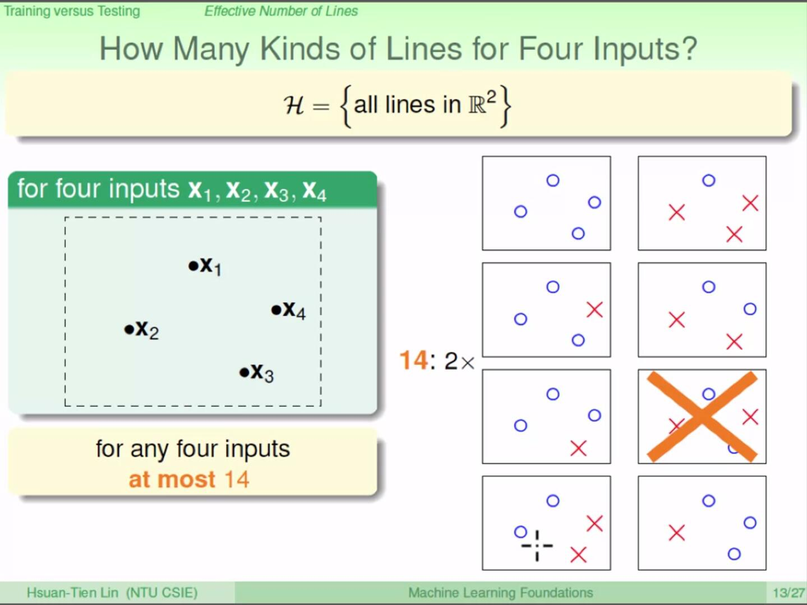

## WHY can machine learn?

### $E_{in} \approx E_{out}$

#### Specific $h$

​	Let's think about the target of learning, it's we want to get a hypothesis and it **works well on both $x$ it has not met (the whole input space).**  It's easy to know the performance on dataset $\mathcal{D}$, but we can one get a real performance on $\mathcal{X}$ cause maybe $\mathcal{X}$ contain infinite $x$. It's tricky for if there is not a criteria to measure the ability of hypothesis, learning is impossible.

​	In order to solve this problem, we define a variable $v$ for a hypothesis $h$, $v = 1\ if\ h(x)\ match\ f(x),\ 0\ if\ h(x)\ match\ f(x)$, $E_{in} = E[v],x\in\mathcal{D}$,$E_{out}=E[v],x\in\mathcal{X}$, where $E$ is `Mathematical Expectation`. In addition we can say $E_{in}$ and $E_{out}$ are performance on $\mathcal{D}$ and $\mathcal{X}$ respectively. According to **Hoeffding's inequality**:
$$
P(|E_{in}-E_{out}|>\epsilon)\leq2\exp{(-2\epsilon^2N)}
$$
Where $\epsilon$ is a small constant we define, $N$ is the size of $\mathcal{D}$ (the number of sample). In other word, we are $1-2\exp{(-2\epsilon^2N)}$ sure that $E_{in}$ and $E_{out}$ differ by less than $\epsilon$. So if $N$  is big enough we almost can say $E_{in} \approx E_{out}$, that means if we find a $h$ that works well on $\mathcal{D}$ with enough samples, it almost can achieve the same good performance on $\mathcal{X}$.

#### Specific $\mathcal{D}$

So far, we have proved that for a specific hypothesis, if we randomly choose a $\mathcal{D}$ with size $N$,  we are $1-2\exp{(-2\epsilon^2N)}$ sure that $E_{in}$ and $E_{out}$ differ by less than $\epsilon$. But what we really need to do is **given a $\mathcal{D}$, find a good $h$ from $\mathcal{H}$.** 

If we assume the size of $\mathcal{H}$ is finite, noted as $M$, then given a $D$, there exists one $h\in\mathcal{H}$ let probability of $|E_{in}-E_{out}|>\epsilon$ is:
$$
\begin{aligned}
&P(BAD\ \mathcal{D})\\
=&P(|E_{in}-E_{out}|>\epsilon\ on\ h_1\ or\ |E_{in}-E_{out}|>\epsilon\ on\ h_2\ or\ ...or\ |E_{in}-E_{out}|>\epsilon\ on\ h_M)\\
\leq &\sum_{m=1}^{M}P(|E_{in}-E_{out}|>\epsilon\ on\ h_m)\\
= &2M\exp{(-2\epsilon^2N)}
\end{aligned}
$$
In other word, under this condition, we could say that we are $1-2M\exp{(-2\epsilon^2N)}$ sure that for any $h$ selected by algorithm $\mathcal{A}$, $E_{in} \approx E_{out}$. Therefore,no matter how $\mathcal{A}$ get the $g$, which make $E_{in} \approx 1$, we can say $E_{out} \approx 1$.

#### Infinite

Actually, learning problem could be split to 2 component. First, we want to prove at some condition, $E_{out}(g)\approx E_{in}(g)$, second, we want algorithm find a $g$ makes $E_{in}(g)\approx 1$.

We have proved that if size of $\mathcal{H}$ is finite and N is big enough, then almost $E_{in} $almost $\approx E_{out}$ for $g$. But if size of $\mathcal{H}$ is infinite, for example, there are numberless lines in PLA, then there is no $M$, of course we can't inference $P(BAD\ \mathcal{D})$ as above way.

Let's **take binary classification as example.** 

##### $m_{\mathcal{H}}$

From perspective of our $\mathcal{D}$, we can classify $\mathcal{H}$ to finite classes, noted as $C={c_1, c_2, ..., c_J}$, $\forall h\in c_j$ gives the same classification result on whole $\mathcal{D}$, which means
$$
\forall h_1,h_2\in c_j, h_1(x_n)==h_2(x_n), n=1,2,...,N
$$
The size of $C$ gives the number of all possible classification on $\mathcal{D}$, noted $|C|=m_{\mathcal{H}}$.

According Lin's explanation, for $\forall h_1,h_2\in c_j$, the $|E_{in}-E_{out}|$ is similar, so $BAD\ \mathcal{D}$ for all $h$ in $c_j$, so 
$$
\begin{aligned}
&P(BAD\ \mathcal{D})\\
=&P(|E_{in}-E_{out}|>\epsilon\ on\ c_1\ or\ |E_{in}-E_{out}|>\epsilon\ on\ c_2\ or\ ...or\ |E_{in}-E_{out}|>\epsilon\ on\ c_{m_{\mathcal{H}}})\\
\leq &\sum_{m=1}^{m_{\mathcal{H}}}P(|E_{in}-E_{out}|>\epsilon\ on\ h_m)\\
= &2m_{\mathcal{H}}\exp{(-2\epsilon^2N)}
\end{aligned}
$$

>  Note: I don't think this inference is that rigorous... because for $\forall h_1,h_2\in c_j$, you can just say $|E_{in}|$ is same, but the number of $E_{out}$ is infinite, and are not necessarily the same.
>
>  But in section 4 week 6, Lin interpret this problem.

So if we can prove
$$
\lim_{N\to +\infty}2m_{\mathcal{H}}\exp{(-2\epsilon^2N)}=0
$$
we can also say $E_{in}\approx E_{out}$. Therefore, now the problem becomes how to inference the relationship between $m_{\mathcal{H}}$ and $N$. 

For binary classification problem, every point may by judged as $+1\ or\ -1$, so there are $2^N$ classification result. Just put $2^N$ into formula above we get $2*2^N\exp{(-2\epsilon^2N)}$, then remove constant 2, we get $2^N\exp{(-2\epsilon^2N)}=(2exp{(-2\epsilon^2)})^N$, if $\epsilon^2 < \frac{ln(2)}{2}$, $2exp{(-2\epsilon^2)}>1$$,$ $\lim_{N\to +\infty}2m_{\mathcal{H}}\exp{(-2\epsilon^2N)}=+\infty$, seems there is no a up boundary.

But as the following slide shows

In a 2d space, when $N=4$, there exist two classification results (we will call  classification result as **dichotomy** from now on) could not be generated by a line, $m_{\mathcal{H}}<2^N$, so when $N > 4$,  $m_{\mathcal{H}}<2^N$. In other word, if N is big enough, $m_{\mathcal{H}}$ maybe not be O($2^N$), if we can prove $m_{\mathcal{H}}\ is\ O(N^c)$ where $c$ is a finite constant (in other word, $m_{\mathcal{H}}$ is polynomial), then formula (5) is proved.

##### break point

Let's take **the first $N$ which makes $m_{\mathcal{H}}<2^N$ as break point $k$,** for example, as described above,  in 2d PLA, our break point is 4. Next, we will prove
$$
m_{\mathcal{H}}\ is\ O(N^{k})
$$

##### scatter

We say a $\mathcal{H}$ scatter a $\mathcal{D}$ if $\mathcal{H}$ can generate $2^N$ dichotomies on $\mathcal{D}$, in other word, $\mathcal{H}$ can generate all possible dichotomies on $\mathcal{D}$.

##### B(N,k)

Now we can see number of dichotomies is determined by $\mathcal{H}$ and $N$. If we define $m_{\mathcal{H}}(N)$ as number of dichotomies for the specific $\mathcal{H}$ ,  It's hard to inference what $m_{\mathcal{H}}(N)$ is the arbitrary $\mathcal{H}$. Therefore, we get back to the second place  and change our aim to **find a upper boundary for the number of  dichotomies for all $\mathcal{H}$ whose break point  is $k$ on $\mathcal{D}$ with size N.** We call this $B(N,k)$.

Sufficient and necessary conditions of break point of $\mathcal{H}$ is $k$ is $\mathcal{H}$ can not scatter any $k$ input of $\mathcal{D}$. Otherwise, when number of input of $\mathcal{D}$ grows to $k$, $\mathcal{H}$ can scatter this $k$ input, thus dichotomies is $2^N$ which conflict with definition of break point (when N = $k$, $m_{\mathcal{H}}<2^N$).

So according to this constrain,  it's easy to know $B(N,1) = 1\ for\ all\ N$, $B(N,k)=2^N\ for\ all\ k\geq N$, and $B(N,N)=2^N-1$, Let us compute what $B(N+1,k)$ is.

Suppose we have known $B(N,k-1)\ and\ B(N-1,k-1)$. For $B(N+1, k)$, the size of it's  dichotomies should be N+1, we need add one more output after some of dichotomies with size $N$. We split dichotomies with size $N+1$ to 2 component:

-   In first component, first $N$ dichotomies appear paired in which one is added on new output $+1$, another is added new output $-1$.  We note this component as $\alpha$.
-   In first component, first $N$ dichotomies appear alone (note first $N$ dichotomy in this component do not overlap with first component), we note this component as $\beta$.

If $|\alpha|>B(N,k-1)$, that means first $N$ dichotomies in $\alpha$ can scatter $k-1$ input, then after we add the new output $+1\ and\ -1$, then first component can scatter $k$, thus the number of first component > $B(N+1,k)$, so $|\alpha|\ must\ \leq B(N,k-1)$.

If $|\alpha| +|\beta| > B(N,k)$, now the size of dichotomy becomes $N+1$, so $|\alpha| +|\beta| > B(N+1,k)$.

Because $B(N+1,k)=2\alpha+\beta$, $B(N+1,k)=2\alpha+\beta \leq B(N,k)+B(N,k-1)$. Applying mathematical induction, we can inference that:
$$
B(N, k) \leq \sum_{i=0}^{k-1}\left(\begin{array}{l}{N} \\ {i}\end{array}\right)
$$
So we can say formula 6 is right, $m_{\mathcal{H}}\ is\ O(N^{k-1})$. 

Return problem above formula (5), we can't just replace $M$ with $m_{\mathcal{H}}$ cause $E_{out}$. After a bunch of proofs, (... **I don't and don't want to understand**), Lin gives:
$$
\mathbb{P}\left[\exists h \in \mathcal{H} \text { s.t. }\left|E_{\text {in }}(h)-E_{\text {out }}(h)\right|>\epsilon\right] \leq 2 \cdot 2 m_{\mu}(2 N) \cdot \exp \left(-2 \cdot \frac{1}{16} \epsilon^{2} N\right)
$$
So for **binary classification**, PLA can really learn something(because PLA do have a break point $k=4$).