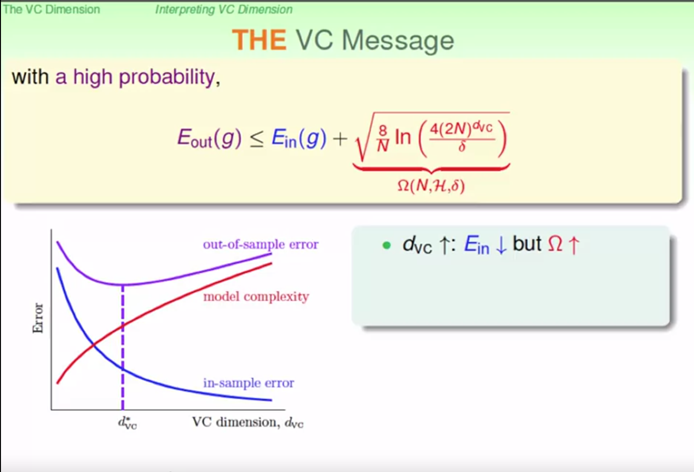

## HOW can machine learn better?

#### VC dimension

Definition: vc dimension ($d_{vc}$) for $\mathcal{H}$ is the maximum number of $|D|$ $\mathcal{H}$ can scatter. Also can be describe as minimum $k-1$.

Obviously, $d_{vc}$ is a property only about $\mathcal{H}$ independent with $\mathcal{A,D}$. If $d_{vc}$ exist (means break point $k$ exists), then according proof in above section, dichotomies can be bounded by a $B(N,k)$, learning is feasible.

##### $d_{vc}$ of n-d PLA

We want to know whether there exist a $d_{vc}$ for arbitrary dimension input and what the $d_{vc}$ is if it does exist. Now we know if input sample is 2 dimension, the break point $k=4,d_{vc}=3$, in the mean time, it's easy to know break point for 1-d PLA $k=3, d_{vc}=2$. We can guess $d_{vc}$ for $d$ dimension input is $d+1$, now we start to prove this.

Our idea is like this: we prove 1. $d_{vc}\geq d+1$, 2. $d_{vc}\leq d+1$, then $d_{vc}==d+1$.

1.   $d_{vc}\geq d+1$

To prove this, we just need to prove there exist a $d$  dimension $\mathcal{D}$ with size $d+1$ can be shatter by $\mathcal{H}$. Lin constructed a matrix like this:
$$
X=\left[\begin{array}{c}{-\mathbf{x}_{1}^{T}-} \\ {-\mathbf{x}_{2}^{T}-} \\ {-\mathbf{x}_{3}^{T}-} \\ {\vdots} \\ {-\mathbf{x}_{d+1}^{T}-}\end{array}\right]=\left[\begin{array}{ccccc}{1} & {0} & {0} & {\ldots} & {0} \\ {1} & {1} & {0} & {\ldots} & {0} \\ {1} & {0} & {1} & {} & {0} \\ {\vdots} & {\vdots} & {} & {\ddots} & {0} \\ {1} & {0} & {\ldots} & {0} & {1}\end{array}\right]
$$
This is a $d+1$ square matrix, in which each row represent an input with dimension $d$, the first column is the bias added on. It's easy to compute out the determinant of this matrix is not 0, so the mat is invertible. 'Invertible' means, for arbitrary $Y$, $Xw=Y$ always is solvable (because $w=X^{-1}Y$). We let $Y$ traverse all possible dichotomies, we can always find a hyper-plane to generate this dichotomy, so $\mathcal{H}$ can scatter $d+1$ dimension input.

2.  $d_{vc}\leq d+1$

Imagine we add a new row ($\mathbf{x}_{d+2}^{T}$) under the matrix, so $\mathbf{x}_{d+2}^{T}$ can be expressed as a linear combination of $\mathbf{x}_{1}^{T}...\mathbf{x}_{d+1}^{T}$:
$$
\mathbf{x}_{d+2}=a_{1} \mathbf{x}_{1}+a_{2} \mathbf{x}_{2}+\ldots+a_{d+1} \mathbf{x}_{d+1}
$$
For a specific $\mathbf{x}_{1}^{T}...\mathbf{x}_{d+1}^{T}$, $\mathbf{x}^{T}_{d+2}$ is determined (neither $>0$ or $<0$, you can find two $\mathbf{x}^{T}_{d+2}$ to satisfy formula (10), not to mention one >0, the other <0). Thus for any $\mathbf{x}_{1}^{T}...,\mathbf{x}_{d+1}^{T},\mathbf{x}_{d+2}^{T}$, $\mathcal{H}$ can scatter this input.

So  1. $d_{vc}\geq d+1$, 2. $d_{vc}\leq d+1$, then $d_{vc}==d+1$.

##### Interpret

$d_{vc}$ also be called degree of freedom, it's vivid. We replace $k-1$ with $d_{vc}$, then we get:
$$
\mathbb{P}_{\mathcal{D}}\left[\left|E_{\text {in }}(g)-E_{\text {out }}(g)\right|>\epsilon\right] \quad \leq \quad 4(2 N)^{d_{v}} \exp \left(-\frac{1}{8} \epsilon^{2} N\right)
$$
We note $4(2 N)^{d_{v}} \exp \left(-\frac{1}{8} \epsilon^{2} N\right)$ as $\delta$,(you may think $\delta$ is an unlucky degree) that means with probability  $\geq 1-\delta$, $\mathbb{P}_{\mathcal{D}}\left[\left|E_{\text {in }}(g)-E_{\text {out }}(g)\right|>\epsilon\right]$. According to formula (11), we also have:
$$
\sqrt{\frac{8}{N} \ln \left(\frac{4(2 N)^{d_{V C}}}{\delta}\right)}=\epsilon
$$
So with $1-\delta$ probability
$$
E_{out}(g)\leq E_{in}(g)-\sqrt{\frac{8}{N} \ln \left(\frac{4(2 N)^{d_{V C}}}{\delta}\right)}
$$
Look at this pic

the bigger $d_{vc}$ become, the more complex our $\mathcal{H}$ become. In this way, our $\mathcal{A}$ have a bigger hypothesis space to search and is prone to find a better $g$ which make $E_{in}$ smaller, but as $d_{vc}$ grows up, $\sqrt{\frac{8}{N} \ln \left(\frac{4(2 N)^{d_{V C}}}{\delta}\right)}$ become bigger, model complexity grows up,too. $E_{out}$ is easy to become worse. So it's a trade-off.

##### a sample

Given a space $\epsilon=0.1, \delta=0.1, d_{\mathrm{Vc}}=3$, if we want $E_{out}(g)\leq E_{in}(g)-\sqrt{\frac{8}{N} \ln \left(\frac{4(2 N)^{d_{V C}}}{\delta}\right)}$, how many sample we need (the $N$).

After computing, we get $N=29300$...Wow, it's really a big branch of sample and is hard to collect in practice. Normally the theory tell us $N\approx 10000d_{vc}$, but there is a practical rule of thumb that if $N \approx 10d_{vc}$ is enough. This is because in the process of proof, we use many very very loose constrains to get the final answer.

All in all, $d_{vc}$ tell us **don't blindly pursue complex models**, or model will pay more one $|E_{in}-E_{out}|$ though you may get a smaller $E_{in}$.

### Noise and Err

#### Noise and probabilistic target

Some time our $\mathcal{D}$ may contain some 'incorrect' sample, because the collected data may be influenced by many factors. Under this condition, we can think that $y$ to $x$ is not a deterministic relationship but a probabilistic relationship. That is to say, $x,y$  is the distribution following $P(x, y)$.For example, $P(Y=+1|X=x)=0.7,P(Y=-1|X=x)=0.3$, you can think that ideal target $x$ is $+1$, but there exist a $0.3$ noise. The target $f$ we want to learn become a distribution $P(Y|X)$.

The deterministic target $f$ can be seen as a special case of target distribution. $P(y|x) = 1,when\ y = f(x);P(y|x) = 1,when\ y \neq f(x)$ .

#### Error Measure

Another big problem is how to measure our output error, after all our $\mathcal{A}$ need a performance to know whether the found $H$ is good. There are 3 property of measurement:

1.  measure on out-of-sample: average one unknow $x$
2.  pointwise, do measure on each input $x$
3.  classification:0/1 error, whether prediction is consist to label

For deterministic $f$, we just count all the wrong classified point and make an average, for probabilistic distribution, we compute the weighted average err or mathematical expectation of err.

Generally  speaking, algorithm of ML is hard to solve. Methods we often use:

#### Algorithmic Error Measure

For classification task, there exist two kind of err:

1.  False accept: real $y=-1$, output $y=+1$
2.  False reject: real $y=+1$, output $y=-1$

So far, we treat them equally. But in some case, one may be more intolerable than the other. For example, if a supermarket discounts for some customers, the market should be more restrict for false reject; if the classification is applied for access control system of CIA, then is should be more restrict for  false accept (because let a unrelated person get access to secret file is a serious accident, but if it just reject legal staff, it will be quoted at most...).

One way to achieve this goal is to give different weight for different type of err in cost measurement. If it's a access control system, compared with false reject err, you can give 1000 times err value of a false accept err.

#### Weighted classification

In some case, we can only collect few positive (negative) samples. Under this condition, if $\mathcal{H}$ only give $-1(+1)$, we will get unbelievable low err, but it's not a good model, it only give constant output. This is because one type of sample dominate $\mathcal{D}$.

There are two way to solve this problem:

1.  virtually copy sample which is not dominant to achieve a balance of two kind of sample. For example, if there are 1000 negative samples and only 10 positive samples, we just copy each positive sample 100 times.
2.  adjust the probability of read sample. Increase the selected probability of sample which is not dominant in data set. For example, if there are 1000 negative samples and only 10 positive samples, we just increase the selected probability of positive sample to 100 times higher than that of negative.