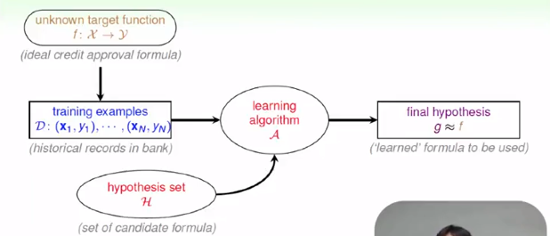
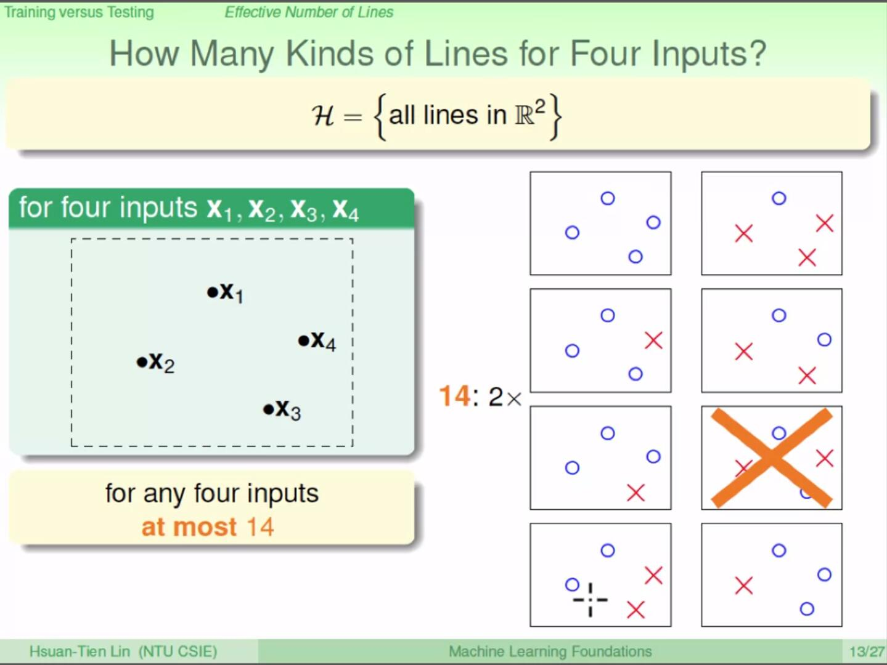

# Machine Learning Foundation

​	In my opinion, unlike other ML courses which introduce lots of  different algorithms, 'Machine Learning Foundation' of professor Lin focus more **foundation** aspects about ML. This course won't (or won't first) tell you detail about a algorithm (such as SVM, Logistic Regression...). On the contrary, he illustrates **when, why, how** machine learning can work form a more macro perspective.

## WHEN can machine Learn?

> When and why should we use machine learning rather than other algorithms? What fields does machine learning  be applied to?

### When should we use ML

​	Learning is the process acquiring  skill from observation. According this definition, machine learning is nothing more than **changing the subject of learning from person to machine.** For a person, the input of learning comes from our sense, such as  visual, auditory. But for a machine, the input is binary data given by people. Both people and machine have the same target that we can perform better on a specific field after learning process. So machine can be illustrate by the following graph:

​	So why should we use ML? After all, applying other algorithms that don't learn, we can also get not bad performance in some field. However, human can not give structure and specific rules for all questions. For example, facing the problem that computers judge if there are trees in a image, no one could find quite specific rules working on computers to solve this. We want machine can acquire this skill by itself, that is just machine learning.

​	All in all, when faced with these following scenarios we should resort to ML:

-   when human **cannot program the system manually**: navigation on Mars
-   when human **cannot define the solution easily**: visual/ speech recognition
-   when needing **rapid decisions that human cannot do**: high-frequency trading
-   when needing to be **user-oriented in a massive scale**: consumer-targeted marketing 
-   ...

Machine learning is powerful but may not work for some fields. Generally speaking, we use machine learning when problem follow these key essences:

1.  exists some **'underlying pattern'** to be learned: we can improve performance
2.  **no (easy) programmable definition**: otherwise, we just write it down
3.  **data is available**: we have input

### Basic Components

​	Basic components of learning problem can be describe as:

-   input space $\mathcal{X}$: all possible input set
-   output space $\mathcal{Y}$:all possible output set
-   data $\mathcal{D}=\{(x_1,y_1),...,(x_N,y_N)\}$, where $x\in \mathcal{X}, y\in \mathcal{Y}$
-   target function $f$: pattern to be learned, the ideal distribution between $\mathcal{X},\mathcal{Y}$ or$\mathcal{X}\to\mathcal{Y}$
-   Hypothesis set $\mathcal{H}$: all possible  $\mathcal{X}\to\mathcal{Y}$ pattern  set
-   Hypothesis $g$: $g\in\mathcal{H}$ , learned formula $\mathcal{X}\to\mathcal{Y}$ with hopefully good performance
-   Algorithm $\mathcal{A}$: method used to select $g$ from $\mathcal{H}$

Slide above show relationship among all these components. It easy to understand. First, we have data set which following ideal pattern, then algorithm takes data set as input, select a relatively good hypothesis from hypothesis set. If the learning algorithm works well, it should find a hypothesis approximately equaling to target function. So we can also define machine learning as: **Using data to compute hypothesis that approximates target hypothesis.**

### ML and Other Fields

​	There exists several fields similar to ML, including Data Mining, Artificial Intelligence and Statistic.

​	**Data Mining**.  DM is 'use huge data to find property that is interesting'. So if 'interesting property' 

1.  **is** 'hypothesis approximating target',  DM = ML
2.  **is related to** 'hypothesis approximating target', DM can help ML

In addition, traditional DM focuses on efficient computation in large database.

​	**Artificial Intelligence**. AI is 'compute something that show intelligence behavior'. So we can regard ML as a  route to AI.

​	**Statistic**. Statistic is 'use data to make inference about unknown process'. So if 'unknow process' is 'hypothesis', statistic can be used by ML. Statistic provides many useful tools for ML. Statistic focus more on mathematic than computation.

### Homework

[homework_1]()

## PLA

​	Well..., perceptron learning algorithm again. Because I've been very familiar with PLA on traditional linearly separable dataset, so I will briefly recap the PLA Model and pay more attention to 

1.  Why PLA must can stop.
2.  PLA on linearly inseparable dataset.

### PLA Model

#### basic component

-   input space $\mathcal{X}$: feature vector of length $d$

-   output space $\mathcal{Y}$:$\{-1,+1\}$
-   data $\mathcal{D}=\{(x_1,y_1),...,(x_N,y_N)\}$, where $x\in \mathcal{X}, y\in \mathcal{Y}$
-   hypothesis $\mathcal{H}$:  $h(\mathbf{x})=\operatorname{sign}\left(w^Tx\right)$, note $x$ is with bias (means it's dim is $d+1$ now)

#### Algorithm

Cycle on whole dataset, if $y_ih(x_i)<0$, let $w=w+y_ix_i$ until $y_ih(x_i)\geq 0$ for all sample. You may also set a learning rate $r$ and a batch $m$ and apply SGD. 

### Why PLA finally stop

​	So why the algorithm above must stop? I never thought about this before.

​	If the dataset is linearly separable, then there exists a $w_f$ which is the ideal parameter. Say, after $t$ circles update, out learned parameter become $w_t$. We compute the following formula:
$$
\frac{w_f}{||w_f||}*\frac{w_t}{||w_t||}
$$
​	Now suppose after $T$ times update, we get a $w_T$ that make formula above equal 1, which means that $w_T$ and $w_f$ are in the same direction, so we can say that we have find the ideal $w_f$, that is $w_T$.

​	If we initialize $w_t$ with 0 vector, after $T$ times update, $w_T=\sum_{t=1}^{T}y_tx_t$ where $y_t, x_t$ is the wrong classified sample at $t$-th update.

1.  we have $w_f*w_T=\sum_{t=1}^{T}y_tw_fx_t$, and $y_tw_fx_t > 0$ for all $t$ because $w_f$ is the perfect parameter we want to get. Therefore, $w_f*w_T=\sum_{t=1}^{T}y_tw_fx_t \geq T*min(y_tw_fx_t) \geq 0$. 
2.  According to property of vector, $||w_T||^2\leq T*max||y_tx_t||^2$, $y_t\in\{-1, +1\}$, so $||w_T||\leq max||x_t||$. *( you may also prove it by simplifying $||w_{t+1}||^2=||w_{t}+y_tx_t||^2$, )it's easy to understand, so I just skip this*, then $||w_T|| < \sqrt{T}max||x_t||$
3.  So we have $\frac{w_f}{||w_f||}*\frac{w_t}{||w_t||}\geq \frac{T*min(y_iw_fx_i)}{||w_f||*\sqrt{T}max||x_t||}=\sqrt{T}\frac{min(y_iw_fx_i)}{||w_f||*max||x_t||}$

Ok, if $T$ is big enough and make $\sqrt{T}\frac{min(y_iw_fx_i)}{||w_f||*max||x_t||}=1$, then we can say after T time update, $w_T$ must equal to $w_f$. So after no more than $\frac{||w_f||^2*max||x_t||^2}{min(y_iw_fx_i)^2}$ times steps, algorithm will stop.

### Pocket Algorithm

​	Then there comes another question that if the dataset is not linearly separable? After we always get some outliers due to noise or some other influence. Under this condition, we have two choice: 1. global optimal, 2. greedy.

​	If we want a global optimal algorithm, the problem becomes:
$$
\underset{\mathbf{w}}{\operatorname{argmin}} \sum_{n=1}^{N}\left[y_{n} \neq \operatorname{sign}\left(\mathbf{w}^{T} \mathbf{x}_{n}\right)\right]
$$
It's a NP-hard problem...., so let use greedy happily\^_\^.

Every time algorithm meets a wrong classified sample, it update the parameter in the same way as PLA do. But, after this, new algorithm apply the updated parameter on the whole dataset and observe whether new parameter works better than the old one. If so, we 'hold the new parameter in pocket'. After some steps, we let the algorithm stop and say the parameter in my pocket is just the result.  

## Type of Learning

This chapter classifies learning models according to different criteria. Just make a summary.

According to **Output space** $\mathcal{Y}$:

- binary classification
- multi-class classification
- regression
- Structured learning: Sequence Tagging

According to **Data Label** $y_n$:

- supervised learning: all $y_n$
- unsupervised learning: no $y_n$
- semi-supervised learning: some $y_n$
- reinforcement learning: implicit $y_n$ by goodness($y_n$)

According to **Protocol** $(x_n, y_n)$:

- batch learning: all known data
- on-line learning: sequential (passive) data
- activate learning: strategically-observed data

According to **input space** $\mathcal{X}$:

- concrete: some high-level feature pre-processed by human
- raw: original information collected
- abstract: abstract feature, may be just a symbol or id

## WHY can machine learn?

### $E_{in} \approx E_{out}$

#### Specific $h$

​	Let's think about the target of learning, it's we want to get a hypothesis and it **works well on both $x$ it has not met (the whole input space).**  It's easy to know the performance on dataset $\mathcal{D}$, but we can one get a real performance on $\mathcal{X}$ cause maybe $\mathcal{X}$ contain infinite $x$. It's tricky for if there is not a criteria to measure the ability of hypothesis, learning is impossible.

​	In order to solve this problem, we define a variable $v$ for a hypothesis $h$, $v = 1\ if\ h(x)\ match\ f(x),\ 0\ if\ h(x)\ match\ f(x)$, $E_{in} = E[v],x\in\mathcal{D}$,$E_{out}=E[v],x\in\mathcal{X}$, where $E$ is `Mathematical Expectation`. In addition we can say $E_{in}$ and $E_{out}$ are performance on $\mathcal{D}$ and $\mathcal{X}$ respectively. According to **Hoeffding's inequality**:
$$
P(|E_{in}-E_{out}|>\epsilon)\leq2\exp{(-2\epsilon^2N)}
$$
Where $\epsilon$ is a small constant we define, $N$ is the size of $\mathcal{D}$ (the number of sample). In other word, we are $1-2\exp{(-2\epsilon^2N)}$ sure that $E_{in}$ and $E_{out}$ differ by less than $\epsilon$. So if $N$  is big enough we almost can say $E_{in} \approx E_{out}$, that means if we find a $h$ that works well on $\mathcal{D}$ with enough samples, it almost can achieve the same good performance on $\mathcal{X}$.

#### Specific $\mathcal{D}$

So far, we have proved that for a specific hypothesis, if we randomly choose a $\mathcal{D}$ with size $N$,  we are $1-2\exp{(-2\epsilon^2N)}$ sure that $E_{in}$ and $E_{out}$ differ by less than $\epsilon$. But what we really need to do is **given a $\mathcal{D}$, find a good $h$ from $\mathcal{H}$.** 

If we assume the size of $\mathcal{H}$ is finite, noted as $M$, then given a $D$, there exists one $h\in\mathcal{H}$ let probability of $|E_{in}-E_{out}|>\epsilon$ is:
$$
\begin{aligned}
&P(BAD\ \mathcal{D})\\
=&P(|E_{in}-E_{out}|>\epsilon\ on\ h_1\ or\ |E_{in}-E_{out}|>\epsilon\ on\ h_2\ or\ ...or\ |E_{in}-E_{out}|>\epsilon\ on\ h_M)\\
\leq &\sum_{m=1}^{M}P(|E_{in}-E_{out}|>\epsilon\ on\ h_m)\\
= &2M\exp{(-2\epsilon^2N)}
\end{aligned}
$$
In other word, under this condition, we could say that we are $1-2M\exp{(-2\epsilon^2N)}$ sure that for any $h$ selected by algorithm $\mathcal{A}$, $E_{in} \approx E_{out}$. Therefore,no matter how $\mathcal{A}$ get the $g$, which make $E_{in} \approx 1$, we can say $E_{out} \approx 1$.

#### Infinite

Actually, learning problem could be split to 2 component. First, we want to prove at some condition, $E_{out}(g)\approx E_{in}(g)$, second, we want algorithm find a $g$ makes $E_{in}(g)\approx 1$.

We have proved that if size of $\mathcal{H}$ is finite and N is big enough, then almost $E_{in} $almost $\approx E_{out}$ for $g$. But if size of $\mathcal{H}$ is infinite, for example, there are numberless lines in PLA, then there is no $M$, of course we can't inference $P(BAD\ \mathcal{D})$ as above way.

Let's **take binary classification as example.** 

##### $m_{\mathcal{H}}$

From perspective of our $\mathcal{D}$, we can classify $\mathcal{H}$ to finite classes, noted as $C={c_1, c_2, ..., c_J}$, $\forall h\in c_j$ gives the same classification result on whole $\mathcal{D}$, which means
$$
\forall h_1,h_2\in c_j, h_1(x_n)==h_2(x_n), n=1,2,...,N
$$
The size of $C$ gives the number of all possible classification on $\mathcal{D}$, noted $|C|=m_{\mathcal{H}}$.

According Lin's explanation, for $\forall h_1,h_2\in c_j$, the $|E_{in}-E_{out}|$ is similar, so $BAD\ \mathcal{D}$ for all $h$ in $c_j$, so 
$$
\begin{aligned}
&P(BAD\ \mathcal{D})\\
=&P(|E_{in}-E_{out}|>\epsilon\ on\ c_1\ or\ |E_{in}-E_{out}|>\epsilon\ on\ c_2\ or\ ...or\ |E_{in}-E_{out}|>\epsilon\ on\ c_{m_{\mathcal{H}}})\\
\leq &\sum_{m=1}^{m_{\mathcal{H}}}P(|E_{in}-E_{out}|>\epsilon\ on\ h_m)\\
= &2m_{\mathcal{H}}\exp{(-2\epsilon^2N)}
\end{aligned}
$$

>  Note: I don't think this inference is that rigorous... because for $\forall h_1,h_2\in c_j$, you can just say $|E_{in}|$ is same, but the number of $E_{out}$ is infinite, and are not necessarily the same.
>
>  But in section 4 week 6, Lin interpret this problem.

So if we can prove
$$
\lim_{N\to +\infty}2m_{\mathcal{H}}\exp{(-2\epsilon^2N)}=0
$$
we can also say $E_{in}\approx E_{out}$. Therefore, now the problem becomes how to inference the relationship between $m_{\mathcal{H}}$ and $N$. 

For binary classification problem, every point may by judged as $+1\ or\ -1$, so there are $2^N$ classification result. Just put $2^N$ into formula above we get $2*2^N\exp{(-2\epsilon^2N)}$, then remove constant 2, we get $2^N\exp{(-2\epsilon^2N)}=(2exp{(-2\epsilon^2)})^N$, if $\epsilon^2 < \frac{ln(2)}{2}$, $2exp{(-2\epsilon^2)}>1$$,$ $\lim_{N\to +\infty}2m_{\mathcal{H}}\exp{(-2\epsilon^2N)}=+\infty$, seems there is no a up boundary.

But as the following slide shows

In a 2d space, when $N=4$, there exist two classification results (we will call  classification result as **dichotomy** from now on) could not be generated by a line, $m_{\mathcal{H}}<2^N$, so when $N > 4$,  $m_{\mathcal{H}}<2^N$. In other word, if N is big enough, $m_{\mathcal{H}}$ maybe not be O($2^N$), if we can prove $m_{\mathcal{H}}\ is\ O(N^c)$ where $c$ is a finite constant (in other word, $m_{\mathcal{H}}$ is polynomial), then formula (5) is proved.

##### break point

Let's take **the first $N$ which makes $m_{\mathcal{H}}<2^N$ as break point $k$,** for example, as described above,  in 2d PLA, our break point is 4. Next, we will prove
$$
m_{\mathcal{H}}\ is\ O(N^{k})
$$

##### scatter

We say a $\mathcal{H}$ scatter a $\mathcal{D}$ if $\mathcal{H}$ can generate $2^N$ dichotomies on $\mathcal{D}$, in other word, $\mathcal{H}$ can generate all possible dichotomies on $\mathcal{D}$.

##### B(N,k)

Now we can see number of dichotomies is determined by $\mathcal{H}$ and $N$. If we define $m_{\mathcal{H}}(N)$ as number of dichotomies for the specific $\mathcal{H}$ ,  It's hard to inference what $m_{\mathcal{H}}(N)$ is the arbitrary $\mathcal{H}$. Therefore, we get back to the second place  and change our aim to **find a upper boundary for the number of  dichotomies for all $\mathcal{H}$ whose break point  is $k$ on $\mathcal{D}$ with size N.** We call this $B(N,k)$.

Sufficient and necessary conditions of break point of $\mathcal{H}$ is $k$ is $\mathcal{H}$ can not scatter any $k$ input of $\mathcal{D}$. Otherwise, when number of input of $\mathcal{D}$ grows to $k$, $\mathcal{H}$ can scatter this $k$ input, thus dichotomies is $2^N$ which conflict with definition of break point (when N = $k$, $m_{\mathcal{H}}<2^N$).

So according to this constrain,  it's easy to know $B(N,1) = 1\ for\ all\ N$, $B(N,k)=2^N\ for\ all\ k\geq N$, and $B(N,N)=2^N-1$, Let us compute what $B(N+1,k)$ is.

Suppose we have known $B(N,k-1)\ and\ B(N-1,k-1)$. For $B(N+1, k)$, the size of it's  dichotomies should be N+1, we need add one more output after some of dichotomies with size $N$. We split dichotomies with size $N+1$ to 2 component:

-   In first component, first $N$ dichotomies appear paired in which one is added on new output $+1$, another is added new output $-1$.  We note this component as $\alpha$.
-   In first component, first $N$ dichotomies appear alone (note first $N$ dichotomy in this component do not overlap with first component), we note this component as $\beta$.

If $|\alpha|>B(N,k-1)$, that means first $N$ dichotomies in $\alpha$ can scatter $k-1$ input, then after we add the new output $+1\ and\ -1$, then first component can scatter $k$, thus the number of first component > $B(N+1,k)$, so $|\alpha|\ must\ \leq B(N,k-1)$.

If $|\alpha| +|\beta| > B(N,k)$, now the size of dichotomy becomes $N+1$, so $|\alpha| +|\beta| > B(N+1,k)$.

Because $B(N+1,k)=2\alpha+\beta$, $B(N+1,k)=2\alpha+\beta \leq B(N,k)+B(N,k-1)$. Applying mathematical induction, we can inference that:
$$
B(N, k) \leq \sum_{i=0}^{k-1}\left(\begin{array}{l}{N} \\ {i}\end{array}\right)
$$
So we can say formula 6 is right, $m_{\mathcal{H}}\ is\ O(N^{k-1})$. 

Return problem above formula (5), we can't just replace $M$ with $m_{\mathcal{H}}$ cause $E_{out}$. After a bunch of proofs, (... **I don't and don't want to understand**), Lin gives:
$$
\mathbb{P}\left[\exists h \in \mathcal{H} \text { s.t. }\left|E_{\text {in }}(h)-E_{\text {out }}(h)\right|>\epsilon\right] \leq 2 \cdot 2 m_{\mu}(2 N) \cdot \exp \left(-2 \cdot \frac{1}{16} \epsilon^{2} N\right)
$$
So for **binary classification**, PLA can really learn something(because PLA do have a break point $k=4$).

## HOW can machine learn better?

#### VC dimension

Definition: vc dimension ($d_{vc}$) for $\mathcal{H}$ is the maximum number of $|D|$ $\mathcal{H}$ can scatter. Also can be describe as minimum $k-1$.

Obviously, $d_{vc}$ is a property only about $\mathcal{H}$ independent with $\mathcal{A,D}$. If $d_{vc}$ exist (means break point $k$ exists), then according proof in above section, dichotomies can be bounded by a $B(N,k)$, learning is feasible.

##### $d_{vc}$ of n-d PLA

We want to know whether there exist a $d_{vc}$ for arbitrary dimension input and what the $d_{vc}$ is if it does exist. Now we know if input sample is 2 dimension, the break point $k=4,d_{vc}=3$, in the mean time, it's easy to know break point for 1-d PLA $k=3, d_{vc}=2$. We can guess $d_{vc}$ for $d$ dimension input is $d+1$, now we start to prove this.

Our idea is like this: we prove 1. $d_{vc}\geq d+1$, 2. $d_{vc}\leq d+1$, then $d_{vc}==d+1$.

1.   $d_{vc}\geq d+1$

To prove this, we just need to prove there exist a $d$  dimension $\mathcal{D}$ with size $d+1$ can be shatter by $\mathcal{H}$. Lin constructed a matrix like this:
$$
X=\left[\begin{array}{c}{-\mathbf{x}_{1}^{T}-} \\ {-\mathbf{x}_{2}^{T}-} \\ {-\mathbf{x}_{3}^{T}-} \\ {\vdots} \\ {-\mathbf{x}_{d+1}^{T}-}\end{array}\right]=\left[\begin{array}{ccccc}{1} & {0} & {0} & {\ldots} & {0} \\ {1} & {1} & {0} & {\ldots} & {0} \\ {1} & {0} & {1} & {} & {0} \\ {\vdots} & {\vdots} & {} & {\ddots} & {0} \\ {1} & {0} & {\ldots} & {0} & {1}\end{array}\right]
$$
This is a $d+1$ square matrix, in which each row represent an input with dimension $d$, the first column is the bias added on. It's easy to compute out the determinant of this matrix is not 0, so the mat is invertible. 'Invertible' means, for arbitrary $Y$, $Xw=Y$ always is solvable (because $w=X^{-1}Y$). We let $Y$ traverse all possible dichotomies, we can always find a hyper-plane to generate this dichotomy, so $\mathcal{H}$ can scatter $d+1$ dimension input.

2.  $d_{vc}\leq d+1$

Imagine we add a new row ($\mathbf{x}_{d+2}^{T}$) under the matrix, so $\mathbf{x}_{d+2}^{T}$ can be expressed as a linear combination of $\mathbf{x}_{1}^{T}...\mathbf{x}_{d+1}^{T}$:
$$
\mathbf{x}_{d+2}=a_{1} \mathbf{x}_{1}+a_{2} \mathbf{x}_{2}+\ldots+a_{d+1} \mathbf{x}_{d+1}
$$
For a specific $\mathbf{x}_{1}^{T}...\mathbf{x}_{d+1}^{T}$, $\mathbf{x}^{T}_{d+2}$ is determined (neither $>0$ or $<0$, you can find two $\mathbf{x}^{T}_{d+2}$ to satisfy formula (10), not to mention one >0, the other <0). Thus for any $\mathbf{x}_{1}^{T}...,\mathbf{x}_{d+1}^{T},\mathbf{x}_{d+2}^{T}$, $\mathcal{H}$ can scatter this input.

So  1. $d_{vc}\geq d+1$, 2. $d_{vc}\leq d+1$, then $d_{vc}==d+1$.

##### Interpret

$d_{vc}$ also be called degree of freedom, it's vivid. We replace $k-1$ with $d_{vc}$, then we get:
$$
\mathbb{P}_{\mathcal{D}}\left[\left|E_{\text {in }}(g)-E_{\text {out }}(g)\right|>\epsilon\right] \quad \leq \quad 4(2 N)^{d_{v}} \exp \left(-\frac{1}{8} \epsilon^{2} N\right)
$$
We note $4(2 N)^{d_{v}} \exp \left(-\frac{1}{8} \epsilon^{2} N\right)$ as $\delta$,(you may think $\delta$ is an unlucky degree) that means with probability  $\geq 1-\delta$, $\mathbb{P}_{\mathcal{D}}\left[\left|E_{\text {in }}(g)-E_{\text {out }}(g)\right|>\epsilon\right]$. According to formula (11), we also have:
$$
\sqrt{\frac{8}{N} \ln \left(\frac{4(2 N)^{d_{V C}}}{\delta}\right)}=\epsilon
$$
So with $1-\delta$ probability
$$
E_{out}(g)\leq E_{in}(g)-\sqrt{\frac{8}{N} \ln \left(\frac{4(2 N)^{d_{V C}}}{\delta}\right)}
$$
Look at this pic

the bigger $d_{vc}$ become, the more complex our $\mathcal{H}$ become. In this way, our $\mathcal{A}$ have a bigger hypothesis space to search and is prone to find a better $g$ which make $E_{in}$ smaller, but as $d_{vc}$ grows up, $\sqrt{\frac{8}{N} \ln \left(\frac{4(2 N)^{d_{V C}}}{\delta}\right)}$ become bigger, model complexity grows up,too. $E_{out}$ is easy to become worse. So it's a trade-off.

##### a sample

Given a space $\epsilon=0.1, \delta=0.1, d_{\mathrm{Vc}}=3$, if we want $E_{out}(g)\leq E_{in}(g)-\sqrt{\frac{8}{N} \ln \left(\frac{4(2 N)^{d_{V C}}}{\delta}\right)}$, how many sample we need (the $N$).

After computing, we get $N=29300$...Wow, it's really a big branch of sample and is hard to collect in practice. Normally the theory tell us $N\approx 10000d_{vc}$, but there is a practical rule of thumb that if $N \approx 10d_{vc}$ is enough. This is because in the process of proof, we use many very very loose constrains to get the final answer.

All in all, $d_{vc}$ tell us **don't blindly pursue complex models**, or model will pay more one $|E_{in}-E_{out}|$ though you may get a smaller $E_{in}$.

### Noise and Err

#### Noise and probabilistic target

Some time our $\mathcal{D}$ may contain some 'incorrect' sample, because the collected data may be influenced by many factors. Under this condition, we can think that $y$ to $x$ is not a deterministic relationship but a probabilistic relationship. That is to say, $x,y$  is the distribution following $P(x, y)$.For example, $P(Y=+1|X=x)=0.7,P(Y=-1|X=x)=0.3$, you can think that ideal target $x$ is $+1$, but there exist a $0.3$ noise. The target $f$ we want to learn become a distribution $P(Y|X)$.

The deterministic target $f$ can be seen as a special case of target distribution. $P(y|x) = 1,when\ y = f(x);P(y|x) = 1,when\ y \neq f(x)$ .

#### Error Measure

Another big problem is how to measure our output error, after all our $\mathcal{A}$ need a performance to know whether the found $H$ is good. There are 3 property of measurement:

1.  measure on out-of-sample: average one unknow $x$
2.  pointwise, do measure on each input $x$
3.  classification:0/1 error, whether prediction is consist to label

For deterministic $f$, we just count all the wrong classified point and make an average, for probabilistic distribution, we compute the weighted average err or mathematical expectation of err.

Generally  speaking, algorithm of ML is hard to solve. Methods we often use:

#### Algorithmic Error Measure

For classification task, there exist two kind of err:

1.  False accept: real $y=-1$, output $y=+1$
2.  False reject: real $y=+1$, output $y=-1$

So far, we treat them equally. But in some case, one may be more intolerable than the other. For example, if a supermarket discounts for some customers, the market should be more restrict for false reject; if the classification is applied for access control system of CIA, then is should be more restrict for  false accept (because let a unrelated person get access to secret file is a serious accident, but if it just reject legal staff, it will be quoted at most...).

One way to achieve this goal is to give different weight for different type of err in cost measurement. If it's a access control system, compared with false reject err, you can give 1000 times err value of a false accept err.

#### Weighted classification

In some case, we can only collect few positive (negative) samples. Under this condition, if $\mathcal{H}$ only give $-1(+1)$, we will get unbelievable low err, but it's not a good model, it only give constant output. This is because one type of sample dominate $\mathcal{D}$.

There are two way to solve this problem:

1.  virtually copy sample which is not dominant to achieve a balance of two kind of sample. For example, if there are 1000 negative samples and only 10 positive samples, we just copy each positive sample 100 times.
2.  adjust the probability of read sample. Increase the selected probability of sample which is not dominant in data set. For example, if there are 1000 negative samples and only 10 positive samples, we just increase the selected probability of positive sample to 100 times higher than that of negative.

